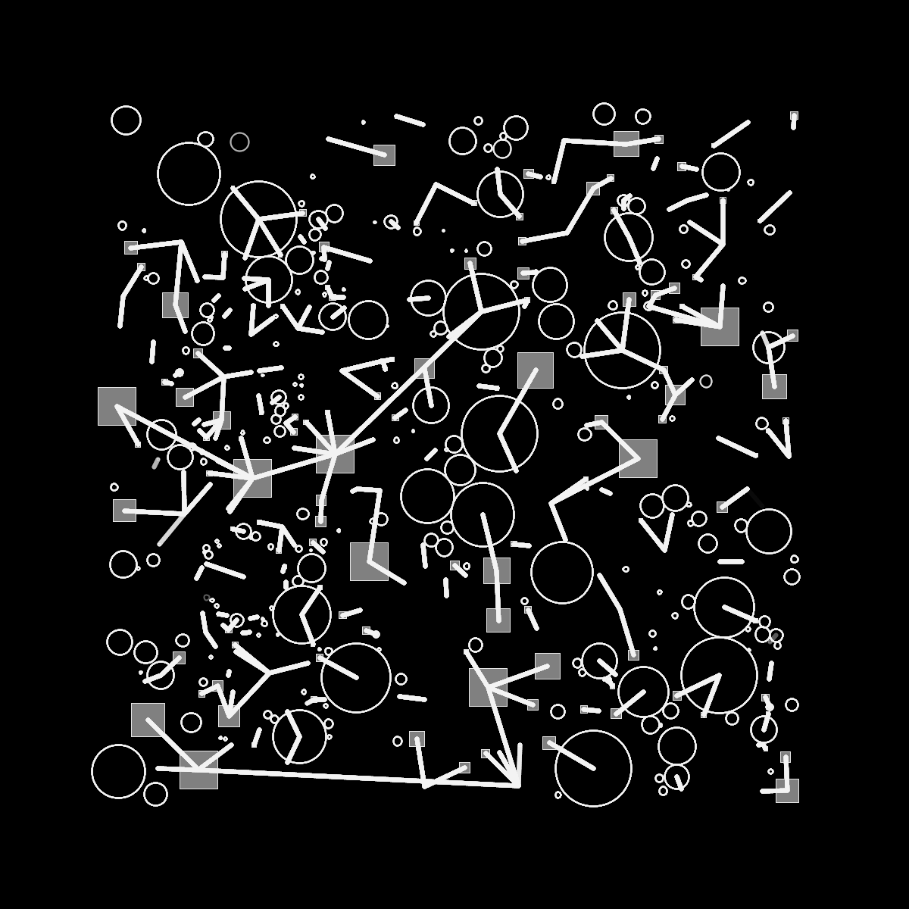
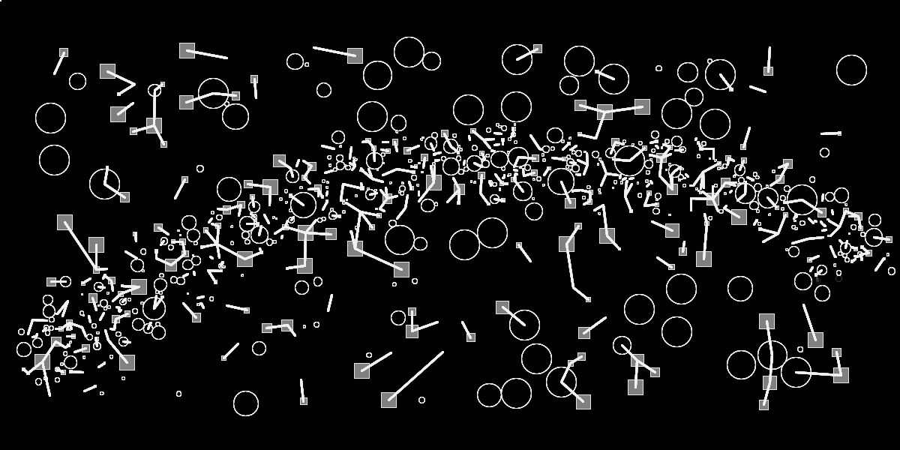

# #175 Digital geometry

Interaktive Skizze bei gezogener Maus und gedrückter Taste.
Strukturdichte aus Agenten Algorithmus.

Dieser Algorithmus platziert eine Struktur an einer zufälligen Position, die wächst, bis sie eine andere Struktur erreicht und berührt und sich mit einer bestimmten Wahrscheinlichkeit, auf zufällige Weise, mit einer Linie von einer zuvor erstellten Form verbindet.

Es ist möglich, mit der Maus zu zeichnen, um benutzerdefinierte Bilder zu erstellen und/oder das Board zu bereinigen und von vorne zu beginnen.

2020

 

 
 

