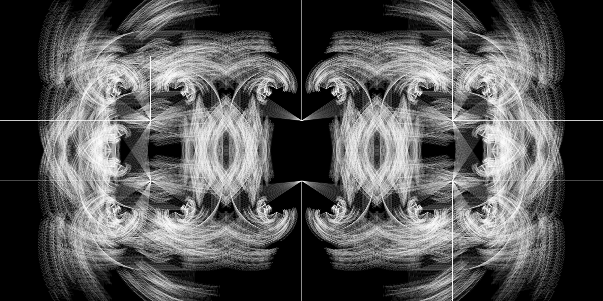
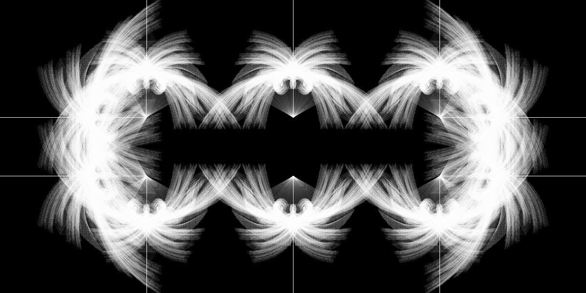
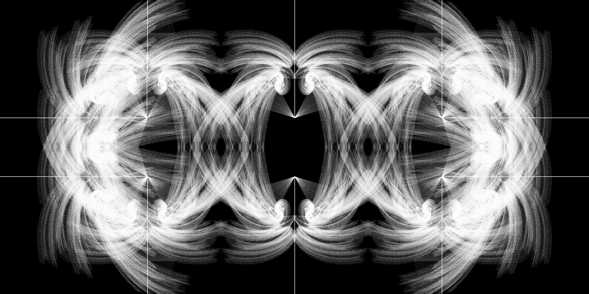

# #94 Fileteado ñ

Video Skizze.
Symmetrischer Baum Fraktal Algorithmus.

Der Tree-Fractal-Algorithmus beginnt mit dem Zeichnen einer Wurzel an einer festen Position und wächst proportional zur Länge (z. B. 1/3 Teile des vorherigen Zweigs), bis die Mindestlänge (in diesem Fall 4 Pixel) erreicht ist.

Mehrere Wurzeln wurden symmetrisch in der Leinwand platziert, diese bewegen und überlappen sich, um zu untersuchen, wie der künstlerische Zeichen- und Schriftstil fileteado porteño aus Buenos Aires nachgebildet werden kann.

Video beigefügt.

2020

 

 
 

 
 

