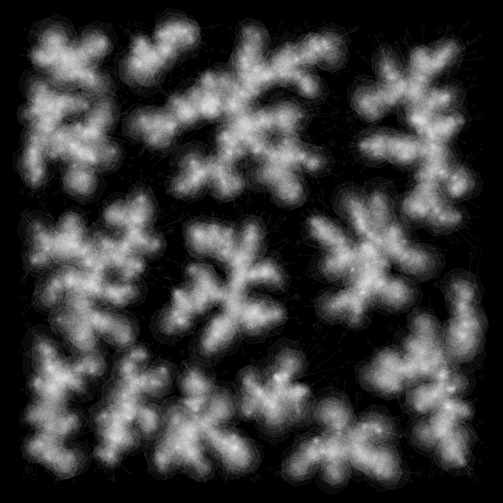
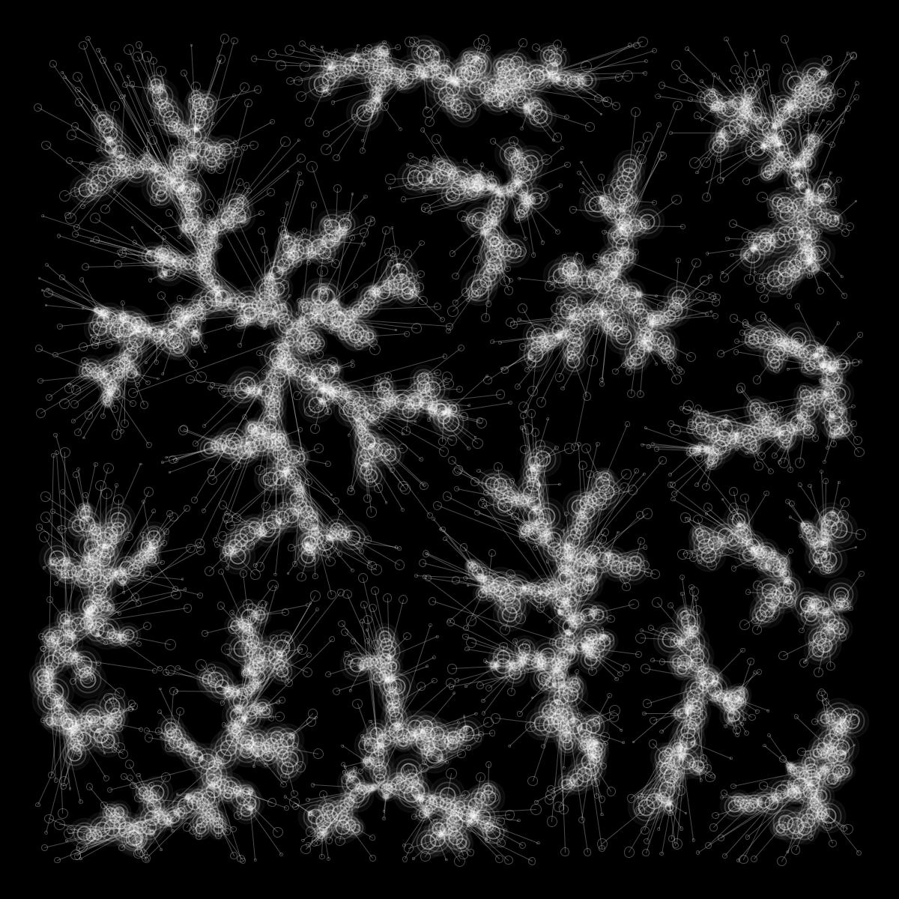
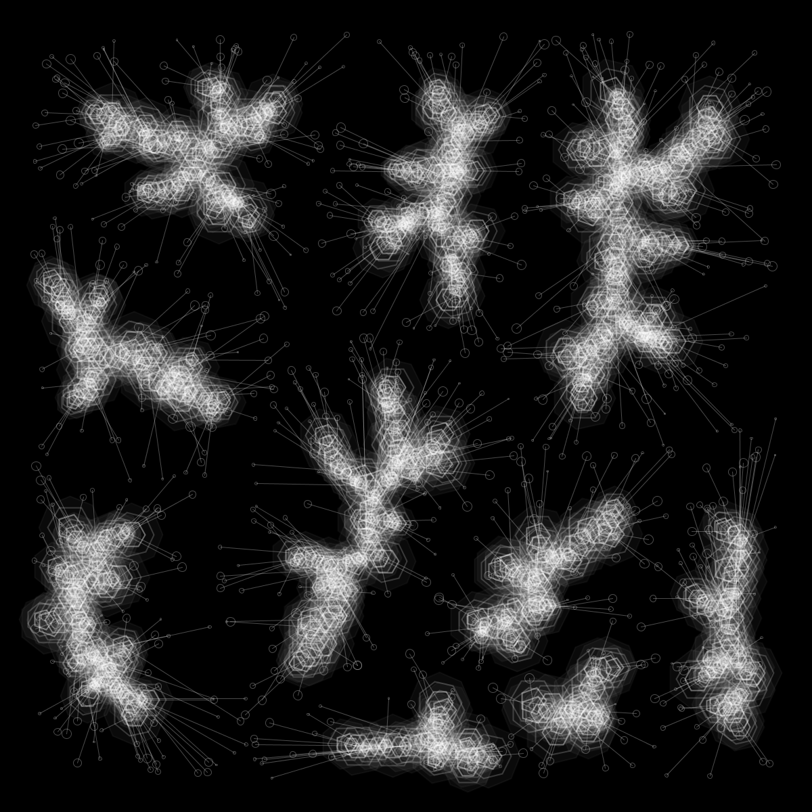

# #91 Fungus

Statische Bilder Skizze.
Wachstumsstruktur aus Agenten Algorithmus.

Solche Algorithmen beschreiben natürliche Wachstumsprozesse in Pflanzen und Mineralien: Formen werden an zufälligen Positionen erstellt und auf kürzestem Weg an den nächsten Nachbarn gestapelt.

Diese Skizzen geben verschiedene Arten von Formen wieder und zeigen die ursprüngliche Position des Agenten.

2020

 

 
 

 
 

