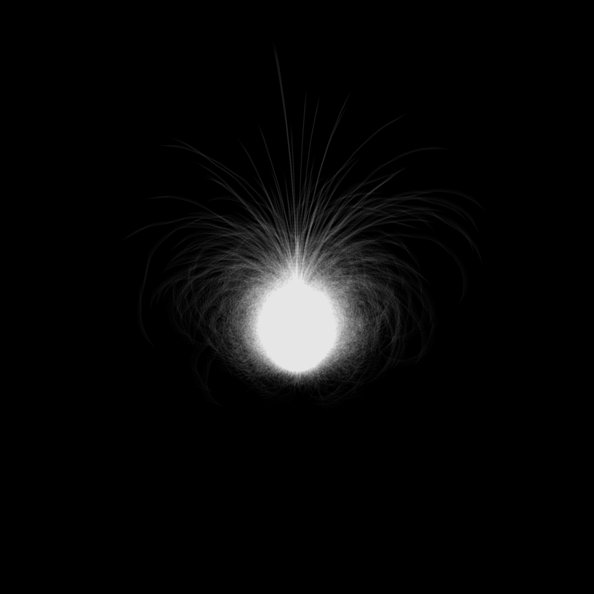

# #146 Organic lights

Statische Bilder Skizze.
Collatz-Vermutung Algorithmus (modifiziert).

Diese Hypothese fragt, ob die Wiederholung von zwei einfachen arithmetischen Operationen schließlich jede positive ganze Zahl in 1 umwandelt, sie wird auch als 3n + 1-Problem bezeichnet.

Um eine kreisförmige Form zu erstellen, dreht der Algorithmus die Zeilenausrichtung um, je nachdem, ob die Zahl ungerade oder gerade ist.

2021

 

 
 

 
 

 
 

