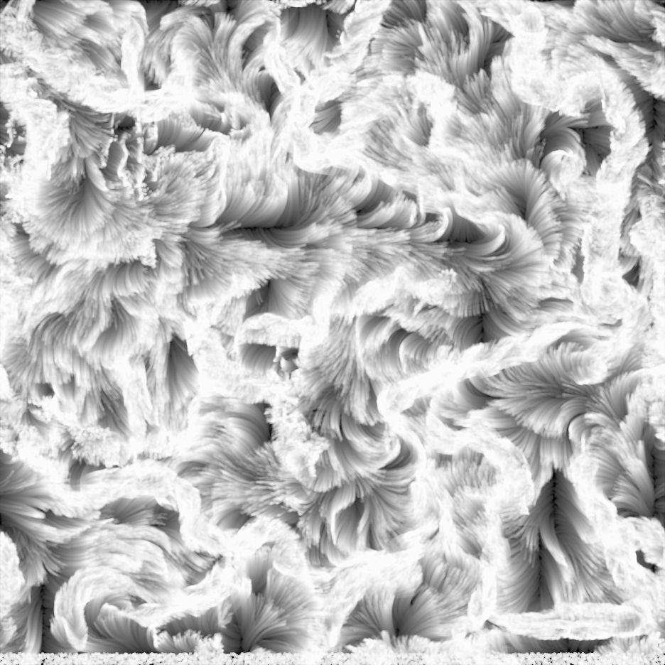
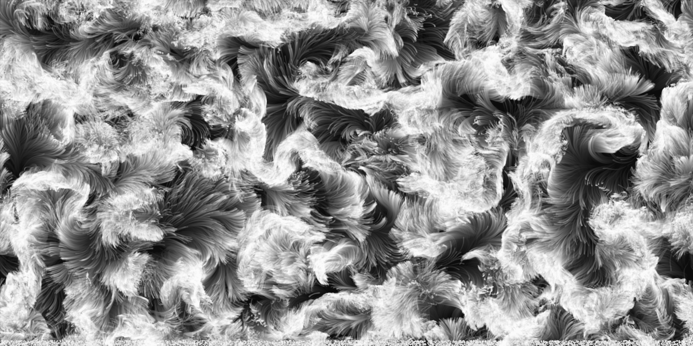

# #47 Pelage

Statische Bilder Skizze.
Perlin-Noise-Flow-Field-Algorithmus.

Inspiriert von Flüssigkeiten und Tierfellen, bildet diese Skizze nach, wie echtes Fell in der Natur wächst und sich bewegt.

Als Flüssigkeiten kann langes Pelage als Flüssigkeiten angesehen werden, die sich auf natürliche Weise bewegen, wenn einige gerichtete Kräfte gegeben sind.

2020

 

 
 

 
 
