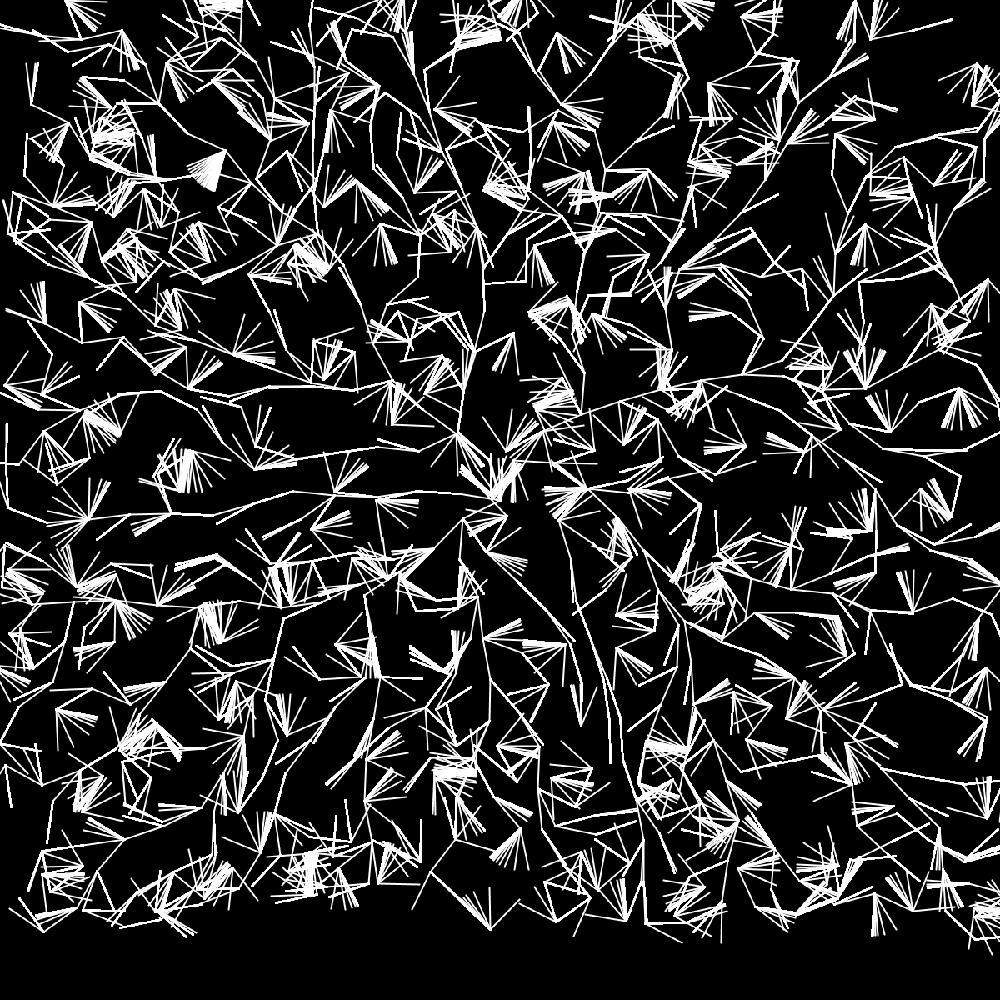
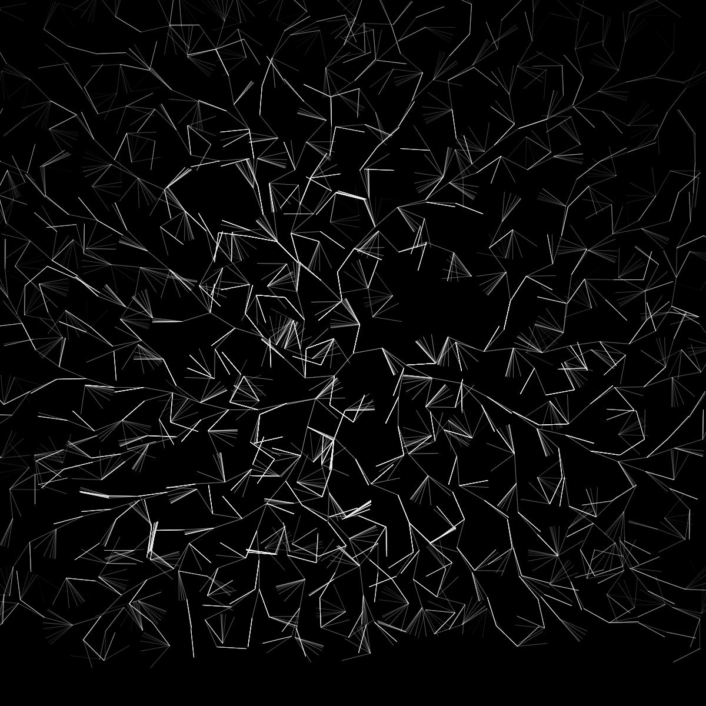
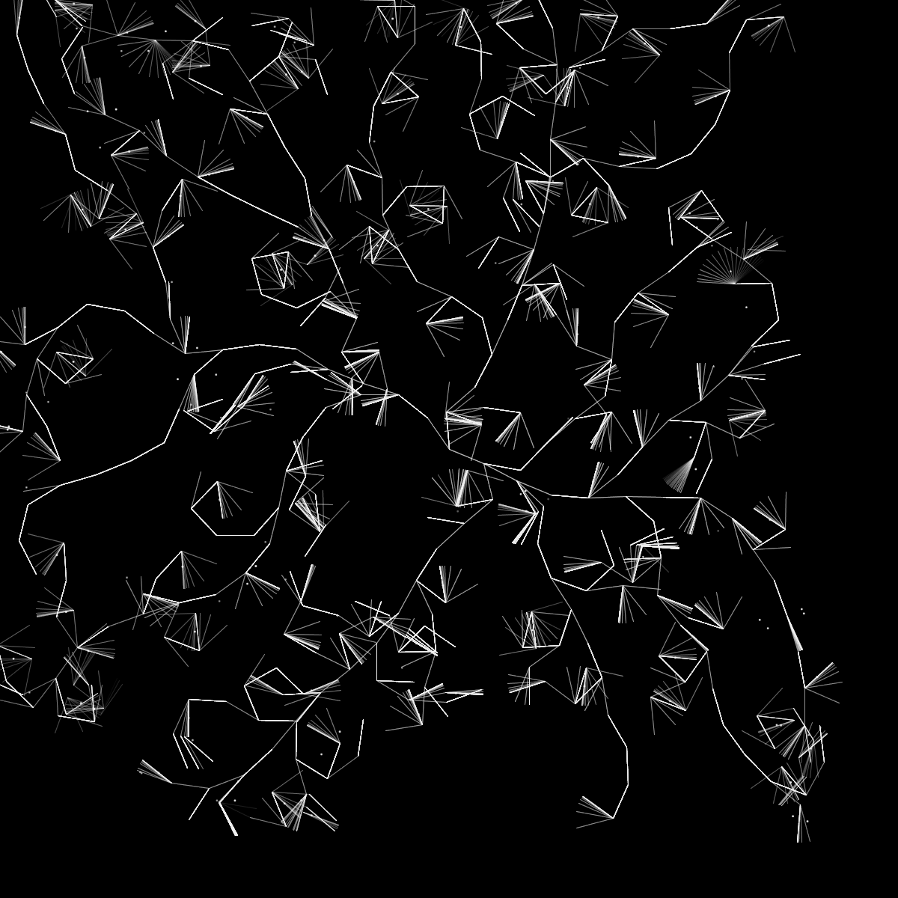

# #53 Rome

Statische Bilder Skizze.
Modellierung von Bäumen mit einem Raum Besiedlung Algorithmus.

Diese Skizze spielt mit der Idee, wie Straßen im Römischen Reich gebaut wurden. „Alle Wege führen nach Rom“, oder genauer gesagt, alle Wege beginnen in Rom.

2022

 

 
 

 
 

 
 
